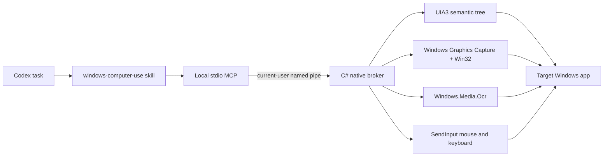

# Windows Computer Use

[简体中文](README.zh-CN.md)

A local Codex plugin for controlling Windows like a human, with semantic UI Automation first and native mouse, keyboard, capture, and OCR fallbacks. It is delivered as the combination the platform is designed for: a Codex skill, a local MCP server, and a native C# Windows broker.

The plugin runs in **full-control mode**. It does not maintain its own app allowlist, action blocklist, or confirmation matrix. It can address any interactive desktop window available to the current Windows user. Codex host permissions, process integrity, UAC secure desktop, and Windows policy remain outside the plugin and cannot be bypassed by it.

## What works today

- UI Automation 3 inspection through FlaUI, including names, AutomationIds, types, bounds, focus, Value/read-only/selection/toggle/expand/scroll states, document text, and selected text.
- Hierarchical UIA descriptors with parent/depth/child metadata, path-stable control ids, automatic stale-element re-location, and incremental observation diffs.
- Semantic `invoke`, explicit `perform_secondary_action` focus/selection/toggle/expand/collapse/scroll actions, and Unicode `enter_text`, with native SendInput fallback.
- Physical pointer-position observation, smooth move/hover, five-button mouse click/drag/wheel, tracked cross-action mouse-down/mouse-up holds, repeated keyboard chords with implied modifiers, tracked key-down/key-up holds, app launching, window activation, and virtual-desktop coordinates.
- Physical multi-monitor topology with per-display bounds, work area, effective DPI, primary flag, and scale percentage.
- Picker-free window PNG capture through native Windows Graphics Capture plus full virtual-desktop screen copy; both return fresh screenshot ids that can ground later physical input.
- Actionable `capture_region` can crop the exact pixels of an observed screenshot id (including nested crops), or acquire a fresh window/desktop frame, while retaining full-source identity for physical input and region-scoped visual waits.
- DWM-visible-frame alignment and explicit `window` / `screen` / `screenshot` coordinate spaces, so WGC pixels map back to physical input without invisible-border offset.
- Native `Windows.Media.Ocr` with line/word bounds; `ocr` and `find_text` can consume exact cached full/region screenshot pixels or acquire a fresh frame, preserving one screenshot identity through OCR-to-click workflows.
- Local PNG/JPEG template matching over exact cached full/region screenshots or fresh frames, with bounded 0.25x-4x multi-scale search, coarse-to-fine sampled color scoring, cross-scale overlap suppression, and same-frame actionable coordinates.
- Native Windows OLE clipboard text read/write plus session-local, all-direct-format backup tokens; atomic `paste_text` and `copy_text` use real Ctrl+V/Ctrl+C, semantic selection/Value verification, clipboard sequence tracking, and restoration on both success and failure.
- Owned-window/root-owner metadata, `wait_for_window` for transient dialogs, and verified minimize/maximize/restore state control.
- State-conditional waits instead of blind sleeps: semantic predicates for UIA, exact-PNG change/stability waits for pixel-only transitions, plus `compare_screenshots` for changed-pixel counts, exact union bounds, and tile-connected local regions between same-source frames.
- Atomic UIA + image `snapshot` observations, timestamped screenshot ids and SHA-256 hashes, plus stale-coordinate rejection after a window moves, resizes, or ages out.
- A local stdio MCP with 42 tools and a current-user named-pipe broker.
- Compatibility with the global UI lock from `desktop-control-for-windows`.
- A real WinForms end-to-end test covering MCP handshake, UIA discovery, rich state diffs, selected text, secondary actions, Chinese input, successful and deliberately failed atomic paste/copy restoration, semantic invoke, condition wait, window/desktop capture, desktop OCR-to-click, persistent key/mouse gestures, and cleanup.

A local visual-language model is not yet implemented. Bounded multi-scale template matching covers known non-text targets across DPI/zoom variance; OCR and model-side image reasoning remain the interpretation layer for novel visuals and rotation. The extended compatibility gate covers Word, Excel, VS Code/Electron, WeChat, and SolidWorks; true multi-monitor/mixed-DPI and elevated-boundary runs still require suitable hardware/process state.

## Architecture



The calling agent chooses the highest reliable layer: application API/browser DOM, UIA3, OCR, then physical pixels. The broker activates the exact selected window, serializes live UI access through the shared lock, performs the action, and re-observes the result. See [architecture.md](plugins/windows-computer-use/docs/architecture.md) and the [tool reference](plugins/windows-computer-use/skills/windows-computer-use/references/tool-reference.md).

## Build and test

Requirements: Windows 10/11, PowerShell 5.1+, and the .NET 8 SDK. The repository build script also detects the SDK installed at `C:\Users\Clr\.codex\tools\dotnet-sdk-8` on the development machine.

```powershell
cd "C:\path\to\windows-computer-use\plugins\windows-computer-use"
powershell -NoProfile -ExecutionPolicy Bypass -File .\scripts\test.ps1
```

`test.ps1` first validates the Codex manifest, marketplace path, MCP launcher, skill/assets, and all PowerShell syntax. It then restores dependencies, builds and publishes the broker/MCP, runs the xUnit suite, opens the isolated WinForms test window, drives it through the real MCP, hard-gates hierarchical UIA/state diffs, Value and selected-text exposure, semantic secondary actions, actionable window/desktop region crops, region-scoped PNG change and continuous-stability waits, selected-window plus unchanged-current-foreground keyboard input, held/implied-modifier state, raw plus atomic Ctrl+V/Ctrl+C round trips (including forced paste/copy failure cleanup), Windows Graphics Capture, OCR and image-template grounding, snapshot freshness, stale-coordinate rejection, and owned-artifact cleanup, closes the test app, and exits non-zero on any failed gate. A separate fault-injection gate forces a 2000 ms broker deadline against a 5000 ms native wait, proves the native process is replaced without terminating MCP, releases a staged Ctrl/mouse hold, and verifies the next tool call. Redirected MCP diagnostics are drained asynchronously so expected-error coverage cannot fill the stderr pipe and deadlock the harness.

For a non-destructive real-app compatibility pass, run `scripts/real-app-smoke.ps1` after building. It opens isolated Notepad, File Explorer, and Settings windows, inspects/captures/OCRs them, and closes only windows whose ids were absent before the test.

Run `scripts/extended-app-smoke.ps1` for isolated Word, Excel, and VS Code/Electron coverage. Add `-IncludeWeChat -IncludeSolidWorks` to cover those installed apps; the script skips any app family that was already running, reads UIA/WGC/OCR only, and closes only process groups created by the test. `-OptionalOnly` runs just the optional apps.

## Local Codex plugin test

Build once, then add this repository root as a local marketplace:

```powershell
cd "C:\path\to\windows-computer-use\plugins\windows-computer-use"
powershell -NoProfile -ExecutionPolicy Bypass -File .\scripts\build.ps1

cd ..\..
codex plugin marketplace add .
```

Install **Windows Computer Use** from the local **Brave Cow Windows Tools** marketplace in Codex. The plugin's `.mcp.json` starts `scripts/run-mcp.ps1`, which launches the local MCP and native broker. For protocol-only testing, start that script directly and send newline-delimited MCP JSON-RPC on stdin.

Broker calls have a 180-second transport deadline so a stuck native UI provider cannot permanently wedge the MCP. Set `WCU_BROKER_CALL_TIMEOUT_MS` to another non-negative millisecond value, or `0` to disable the deadline completely. A timeout is never auto-replayed: the MCP replaces the broker, releases plugin-tracked held input, returns an explicit unknown-state error, and requires a fresh observation before another action.

## MCP surface

The 42 tools are `list_windows`, `display_info`, `pointer_position`, `window_from_point`, `launch_app`, `wait_for_window`, `inspect_window`, `observe_changes`, `find_controls`, `invoke`, `perform_secondary_action`, `enter_text`, `paste_text`, `copy_text`, `wait_for_ui`, `wait_for_visual_change`, `wait_for_visual_stable`, `compare_screenshots`, `capture`, `capture_region`, `observe_desktop`, `snapshot`, `ocr`, `find_text`, `find_image`, `read_clipboard_text`, `write_clipboard_text`, `restore_clipboard`, `move_pointer`, `click`, `mouse_down`, `mouse_up`, `press_key`, `key_down`, `key_up`, `type_text`, `scroll`, `drag`, `set_window_state`, `set_window_bounds`, `activate_window`, and `end_session`.

Use the exact window id returned by `list_windows`; the broker rehydrates that HWND directly while it is temporarily hidden or untitled. If an app recreates the HWND, the old id follows the unique replacement only when process id, native class, and non-empty title still match; otherwise it fails closed and requires a fresh selection. Use `wait_for_window` plus `owner_window_id` for transient dialogs. Prefer stable control ids from `inspect_window`/`find_controls`, inspect their current state fields, and pass an earlier `observation_id` to `observe_changes` after transitions. Use `perform_secondary_action` when the intended UIA action is more specific than a primary invoke. Otherwise use `find_text` for text, `find_image` for a known local template (optionally with a bounded scale range), or `snapshot` for model vision, then pass the returned `screenshot_id` with `coordinate_space: "screenshot"`. `capture`, `ocr`, `find_text`, and `find_image` accept `desktop: true`; their virtual-desktop screenshot ids can drive move/click/mouse-down/mouse-up/scroll/drag without selecting or foregrounding a window, and explicit `coordinate_space: "screen"` supports direct full-desktop input. Semantic/input actions invalidate older screenshots; the broker rejects ids if a target moved/resized, display topology changed, or `max_age_ms` elapsed. Restore minimized windows before window-scoped visual observation. Legacy selected-window coordinates remain physical window-relative pixels by default.

Screenshot-bound `click`, `mouse_down`, `mouse_up`, `scroll`, and self-contained `drag` automatically compare the original full/region pixels with the post-action capture. Their `data.visual_diff` includes comparability, changed count/fraction, maximum channel delta, exact image/screen union bounds, and up to 20 localized regions. Every mouse-down/up also re-observes: chain the `after_screenshot_id` returned by `mouse_down` into `mouse_up` to keep a long gesture grounded while held-button state remains tracked. If the action changed source geometry, the action still succeeds but reports `comparable=false` with the before/after bounds instead of throwing. Direct-screen or unbound window actions have no trusted before frame and therefore omit this summary, but still return a fresh post-action desktop/window id.

For whole-screen work, `observe_desktop` replaces four round trips with one read-only observation: it returns the virtual-desktop PNG plus monitor topology, visible top-level windows, and pointer position. Its desktop screenshot id is immediately actionable with screenshot-space pointer/mouse tools and it never selects or activates a window.

When no reliable semantic predicate exists, pass a fresh window or desktop `screenshot_id` to `wait_for_visual_change`. It repeatedly captures that exact source, rejects stale geometry/topology, compares exact PNG SHA-256 content, and returns a new actionable PNG whether it matched or timed out. Prefer `wait_for_ui` when possible: animations, clocks, blinking carets, and any unrelated desktop pixel can legitimately satisfy an exact visual-change wait.

After a change starts, `wait_for_visual_stable` requires fresh captures to keep the same exact PNG hash for `stable_ms` continuously. A changed sample resets the timer; a late or impossible-to-stabilize source returns `stable: false` plus the latest image at `timeout_ms`. It observes stability only after the call begins, not from the age of the source screenshot. Dynamic clocks, carets, video, and desktop notifications can prevent full-frame stability.

Use `compare_screenshots` when a hash change must be localized. Both fresh ids must represent the same window/desktop source, geometry, and exact crop. The broker compares decoded BGRA pixels, returns exact changed-pixel count/fraction and union bounds, then groups changed tiles into bounded local regions with image and physical screen bounds. `channel_threshold=0` is exact; raise it only to ignore known minor rendering noise. The tool does not capture, activate, or send input.

Use `capture_region` when only one image-relative rectangle matters. Pass a fresh `screenshot_id` to crop the exact already-observed pixels without a second capture; that id is authoritative, so window/desktop selectors cannot be mixed into the call. Without an id, the tool acquires a fresh selected window or desktop frame. `x/y/width/height` are relative to the chosen source image, including an earlier crop. The returned PNG reports physical `bounds`, `(0,0)` maps to that physical origin, and nested crops accumulate the original full-source offset. Visual change/stability waits re-capture only the final region while still rejecting full window geometry or desktop-topology drift.

Pass that same fresh full or region `screenshot_id` to `ocr` or `find_text` to recognize exactly the pixels already returned to the model. The broker validates age and original geometry/topology, writes only a temporary local PNG for the Windows OCR adapter, deletes it after recognition, and returns the unchanged screenshot id/bounds/hash. `find_text` centers therefore drive screenshot-space input against the same frame. Cached sources are mutually exclusive with `desktop`/window selectors; `ocr path` is a separate authoritative, non-actionable existing-image mode.

`find_image` accepts the same cached screenshot contract without writing it to disk: the local matcher decodes the cached PNG in memory, searches exact or bounded scales, and returns centers plus physical bounds bound to the unchanged screenshot id/hash. This is the preferred template path after `snapshot`, `observe_desktop`, or `capture_region`; omit the id only when a deliberately fresh frame is required.

Before acting on an ambiguous screen pixel, `window_from_point` can map physical x/y to both the actual native child HWND/class/title under that pixel and its top-level root window descriptor. This gives the agent a stable `window_id` for UIA inspection or confirms which app a later mouse action would reach, without moving the pointer, activating, or clicking.

`press_key`, `key_down`, `key_up`, and `type_text` also accept `desktop: true`. This sends directly to the unchanged current foreground focus and never activates a selected target; it is therefore mutually exclusive with `window_id`, `title`, and `app`. Prefer explicit window mode when the destination is known, and use desktop mode for system shortcuts or an already-established foreground/focus chain.

`set_window_bounds` moves and resizes an exact HWND using physical virtual-desktop pixels rather than title-bar drag guesses. Negative origins are accepted for left/upper monitors. It restores minimized/maximized windows before moving, verifies the exact Win32 outer rectangle, and preserves the existing foreground unless `activate: true` is requested. True multi-monitor placement remains an external hardware-matrix item on this single-monitor development machine.

For transfer-only workflows, prefer `paste_text`/`copy_text`. Paste replaces or appends and waits for observable UIA Value; copy preserves the current selection or selects all, waits for a real clipboard sequence change, and performs at most one semantic-refocus retry when publication is missing or disagrees with the UIA selection. It then returns Unicode text and restores. Both preserve every direct format and restore before returning—even after verification or input failure. Clipboard publication/restoration tolerates bounded external ownership contention for up to ten seconds. Use the lower-level `write_clipboard_text`/`restore_clipboard` pair only when clipboard state must span multiple actions. Backup ids are broker-session-local; unsupported formats fail before mutation.

## Repository layout

```text
.agents/plugins/marketplace.json       local marketplace
plugins/windows-computer-use/
  .codex-plugin/plugin.json            Codex plugin manifest
  .mcp.json                            local MCP registration
  skills/windows-computer-use/         agent workflow and references
  src/WindowsComputerUse.Mcp/          MCP stdio host
  src/WindowsComputerUse.Broker/       UIA3/Win32/SendInput broker
  src/WindowsComputerUse.TestApp/      deterministic real-UI fixture
  scripts/                             build, launch, OCR, and E2E gates
  tests/                               protocol and native smoke tests
```

## License

MIT
