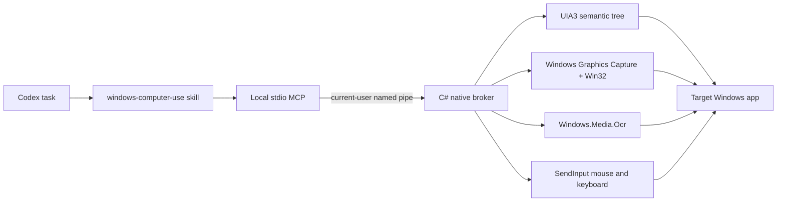

# Windows Computer Use

[简体中文](README.zh-CN.md)

A local Codex plugin for controlling Windows like a human, with semantic UI Automation first and native mouse, keyboard, capture, and OCR fallbacks. It is delivered as the combination the platform is designed for: a Codex skill, a local MCP server, and a native C# Windows broker.

The plugin runs in **full-control mode**. It does not maintain its own app allowlist, action blocklist, or confirmation matrix. It can address any interactive desktop window available to the current Windows user. Codex host permissions, process integrity, UAC secure desktop, and Windows policy remain outside the plugin and cannot be bypassed by it.

## What works today

- UI Automation 3 inspection through FlaUI, including names, AutomationIds, types, bounds, focus, Value/read-only/selection/toggle/expand/scroll states, document text, and selected text.
- Hierarchical UIA descriptors with parent/depth/child metadata, path-stable control ids, automatic stale-element re-location, and incremental observation diffs.
- Semantic `invoke`, explicit `perform_secondary_action` focus/selection/toggle/expand/collapse/scroll actions, and Unicode `enter_text`, with native SendInput fallback.
- Physical pointer-position observation, smooth move/hover, five-button mouse click/drag/wheel, tracked cross-action mouse-down/mouse-up holds, repeated keyboard chords with implied modifiers, tracked key-down/key-up holds, app launching, window activation, and virtual-desktop coordinates.
- Physical multi-monitor topology with per-display bounds, work area, effective DPI, primary flag, and scale percentage.
- Picker-free window PNG capture through native Windows Graphics Capture, with `PrintWindow` and screen-copy fallback.
- DWM-visible-frame alignment and explicit `window` / `screen` / `screenshot` coordinate spaces, so WGC pixels map back to physical input without invisible-border offset.
- Native `Windows.Media.Ocr` with line/word bounds, screenshot-bound fresh OCR, and `find_text` grounding for direct OCR-to-click workflows.
- Local PNG/JPEG template matching with bounded 0.25x-4x multi-scale search, coarse-to-fine sampled color scoring, cross-scale overlap suppression, and fresh screenshot-bound coordinates for non-text icons and canvas targets.
- Owned-window/root-owner metadata, `wait_for_window` for transient dialogs, and verified minimize/maximize/restore state control.
- State-conditional waits instead of blind sleeps: existence/visibility/focus plus Value equality/containment, selected/unselected, toggle, expand/collapse, and read-only/editable predicates; every action is automatically re-observed.
- Atomic UIA + image `snapshot` observations, timestamped screenshot ids and SHA-256 hashes, plus stale-coordinate rejection after a window moves, resizes, or ages out.
- A local stdio MCP with 30 tools and a current-user named-pipe broker.
- Compatibility with the global UI lock from `desktop-control-for-windows`.
- A real WinForms end-to-end test covering MCP handshake, UIA discovery, rich state diffs, selected text, secondary actions, Chinese input, semantic invoke, condition wait, capture, OCR, persistent key/mouse gestures, and cleanup.

A local visual-language model is not yet implemented. Bounded multi-scale template matching covers known non-text targets across DPI/zoom variance; OCR and model-side image reasoning remain the interpretation layer for novel visuals and rotation. The extended compatibility gate covers Word, Excel, VS Code/Electron, WeChat, and SolidWorks; true multi-monitor/mixed-DPI and elevated-boundary runs still require suitable hardware/process state.

## Architecture



The calling agent chooses the highest reliable layer: application API/browser DOM, UIA3, OCR, then physical pixels. The broker activates the exact selected window, serializes live UI access through the shared lock, performs the action, and re-observes the result. See [architecture.md](plugins/windows-computer-use/docs/architecture.md) and the [tool reference](plugins/windows-computer-use/skills/windows-computer-use/references/tool-reference.md).

## Build and test

Requirements: Windows 10/11, PowerShell 5.1+, and the .NET 8 SDK. The repository build script also detects the SDK installed at `C:\Users\Clr\.codex\tools\dotnet-sdk-8` on the development machine.

```powershell
cd "C:\path\to\windows-computer-use\plugins\windows-computer-use"
powershell -NoProfile -ExecutionPolicy Bypass -File .\scripts\test.ps1
```

`test.ps1` first validates the Codex manifest, marketplace path, MCP launcher, skill/assets, and all PowerShell syntax. It then restores dependencies, builds and publishes the broker/MCP, runs the xUnit suite, opens the isolated WinForms test window, drives it through the real MCP, hard-gates hierarchical UIA/state diffs, Value and selected-text exposure, semantic secondary actions, state-conditional waits, held/implied-modifier keyboard input, Windows Graphics Capture, OCR and image-template grounding, snapshot freshness, and stale-coordinate rejection, closes the test app, and exits non-zero on any failed gate.

For a non-destructive real-app compatibility pass, run `scripts/real-app-smoke.ps1` after building. It opens isolated Notepad, File Explorer, and Settings windows, inspects/captures/OCRs them, and closes only windows whose ids were absent before the test.

Run `scripts/extended-app-smoke.ps1` for isolated Word, Excel, and VS Code/Electron coverage. Add `-IncludeWeChat -IncludeSolidWorks` to cover those installed apps; the script skips any app family that was already running, reads UIA/WGC/OCR only, and closes only process groups created by the test. `-OptionalOnly` runs just the optional apps.

## Local Codex plugin test

Build once, then add this repository root as a local marketplace:

```powershell
cd "C:\path\to\windows-computer-use\plugins\windows-computer-use"
powershell -NoProfile -ExecutionPolicy Bypass -File .\scripts\build.ps1

cd ..\..
codex plugin marketplace add .
```

Install **Windows Computer Use** from the local **Brave Cow Windows Tools** marketplace in Codex. The plugin's `.mcp.json` starts `scripts/run-mcp.ps1`, which launches the local MCP and native broker. For protocol-only testing, start that script directly and send newline-delimited MCP JSON-RPC on stdin.

## MCP surface

The 30 tools are `list_windows`, `display_info`, `pointer_position`, `launch_app`, `wait_for_window`, `inspect_window`, `observe_changes`, `find_controls`, `invoke`, `perform_secondary_action`, `enter_text`, `wait_for_ui`, `capture`, `snapshot`, `ocr`, `find_text`, `find_image`, `move_pointer`, `click`, `mouse_down`, `mouse_up`, `press_key`, `key_down`, `key_up`, `type_text`, `scroll`, `drag`, `set_window_state`, `activate_window`, and `end_session`.

Use the exact window id returned by `list_windows`; the broker rehydrates that HWND directly while it is temporarily hidden or untitled. If an app recreates the HWND, the old id follows the unique replacement only when process id, native class, and non-empty title still match; otherwise it fails closed and requires a fresh selection. Use `wait_for_window` plus `owner_window_id` for transient dialogs. Prefer stable control ids from `inspect_window`/`find_controls`, inspect their current state fields, and pass an earlier `observation_id` to `observe_changes` after transitions. Use `perform_secondary_action` when the intended UIA action is more specific than a primary invoke. Otherwise use `find_text` for text, `find_image` for a known local template (optionally with a bounded scale range), or `snapshot` for model vision, then pass the returned `screenshot_id` with `coordinate_space: "screenshot"`. Semantic/input actions invalidate older screenshots; the broker also rejects ids if the target moved, resized, or exceeded `max_age_ms`. Restore minimized windows before visual observation. Legacy coordinates remain physical window-relative pixels by default.

## Repository layout

```text
.agents/plugins/marketplace.json       local marketplace
plugins/windows-computer-use/
  .codex-plugin/plugin.json            Codex plugin manifest
  .mcp.json                            local MCP registration
  skills/windows-computer-use/         agent workflow and references
  src/WindowsComputerUse.Mcp/          MCP stdio host
  src/WindowsComputerUse.Broker/       UIA3/Win32/SendInput broker
  src/WindowsComputerUse.TestApp/      deterministic real-UI fixture
  scripts/                             build, launch, OCR, and E2E gates
  tests/                               protocol and native smoke tests
```

## License

MIT
