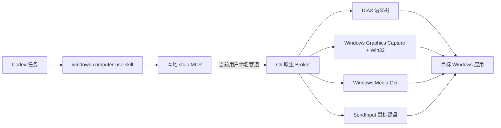

# Windows Computer Use

[English](README.md)

这是一个让 Codex 像人类一样操作 Windows 的本地插件：优先使用 Windows UI Automation 语义控件，在语义层不足时降级到原生鼠标、键盘、截图与 OCR。项目按 Codex 官方插件形态交付，由 **Codex skill + 本地 MCP + C# Windows 原生 Broker** 三层组成。

插件默认运行在 **full-control（完全控制）模式**：自身不维护应用白名单、动作黑名单或二次确认矩阵；当前 Windows 用户能交互的桌面窗口，它都可以寻址和操作。Codex 宿主权限、进程完整性、UAC 安全桌面和 Windows 系统策略仍属于插件外部边界，插件无法绕过。

## 当前已实现

- 基于 FlaUI 的 UI Automation 3 语义检查：名称、AutomationId、控件类型、坐标、状态、Pattern 与焦点。
- 带 parent/depth/child 元数据的层级 UIA、路径稳定控件 ID、失效元素自动重定位，以及基于 observation ID 的增量差异。
- 语义 `invoke` 与 Unicode `enter_text`，失败后降级到原生 SendInput。
- 物理鼠标位置读取、平滑移动/悬停、点击、拖拽、滚轮、组合键、应用启动、窗口激活和虚拟桌面坐标。
- 物理多屏拓扑：每块显示器的边界、工作区、有效 DPI、主屏标记和缩放百分比。
- 无系统选框的原生 Windows Graphics Capture 窗口 PNG 捕获，并保留 `PrintWindow` 与屏幕复制降级。
- 以 DWM 可见边界对齐 WGC，并显式支持 `window` / `screen` / `screenshot` 坐标空间，避免不可见缩放边框造成点击偏移。
- 原生 `Windows.Media.Ocr` 行/词边界、带截图 ID 的新鲜 OCR，以及可直接衔接点击的 `find_text` 文本定位。
- 窗口 owner/root-owner 关系、用于瞬态弹窗的 `wait_for_window`，以及带验证的最小化/最大化/还原控制。
- 条件等待代替盲目 sleep；每次动作后自动重新观测验证。
- 一次调用同时返回 UIA 与画面的 `snapshot`，带时间、截图 ID 和 SHA-256；窗口移动、缩放或截图过期后拒绝继续盲点。
- 24 个工具的本地 stdio MCP，以及仅当前用户可连接的命名管道 Broker。
- 与 `desktop-control-for-windows` 共用全局 UI 锁协议。
- 真实 WinForms 端到端测试：MCP 握手、UIA 发现、中文输入、语义 Invoke、状态等待、截图、OCR 与清理。

本地视觉语言定位仍未实现，当前视觉理解层使用 OCR 与模型侧图像推理。扩展兼容门禁已覆盖 Word、Excel、VS Code/Electron、微信和 SolidWorks；真正的多屏/混合 DPI 与高完整性边界仍需对应硬件和进程状态。

## 架构



调用方按可靠性选择最高层：应用 API/浏览器 DOM → UIA3 → OCR → 物理像素。Broker 会激活精确目标窗口，通过共享锁串行化实时桌面访问，执行动作，并重新观测结果。详见 [架构说明](plugins/windows-computer-use/docs/architecture.md) 与 [工具参考](plugins/windows-computer-use/skills/windows-computer-use/references/tool-reference.md)。

## 构建与测试

要求：Windows 10/11、PowerShell 5.1+、.NET 8 SDK。仓库脚本也会识别开发机上的 `C:\Users\Clr\.codex\tools\dotnet-sdk-8` SDK。

```powershell
cd "C:\path\to\windows-computer-use\plugins\windows-computer-use"
powershell -NoProfile -ExecutionPolicy Bypass -File .\scripts\test.ps1
```

`test.ps1` 会还原依赖、构建并发布 Broker/MCP、运行 xUnit、打开隔离的 WinForms 测试窗口，并硬性验证层级 UIA/增量差异、WGC、快照失效与新鲜度、过期坐标拒绝和 OCR；任一门禁失败都会返回非零退出码。

构建后还可运行 `scripts/real-app-smoke.ps1` 做非破坏性真实应用兼容测试：它会打开隔离的记事本、资源管理器和设置窗口，完成 UIA/截图/OCR，并且只关闭测试前不存在的窗口 ID。

运行 `scripts/extended-app-smoke.ps1` 可覆盖隔离的 Word、Excel 和 VS Code/Electron；追加 `-IncludeWeChat -IncludeSolidWorks` 覆盖已安装的微信与 SolidWorks，`-OptionalOnly` 只跑可选应用。已有同类进程会被跳过保护，测试只读取 UIA/WGC/OCR，并只关闭本次新建的进程组。

## 在 Codex 本地安装测试

先构建，再把仓库根目录加入本地 marketplace：

```powershell
cd "C:\path\to\windows-computer-use\plugins\windows-computer-use"
powershell -NoProfile -ExecutionPolicy Bypass -File .\scripts\build.ps1

cd ..\..
codex plugin marketplace add .
```

随后在 Codex 的本地 **Brave Cow Windows Tools** marketplace 中安装 **Windows Computer Use**。插件 `.mcp.json` 会启动 `scripts/run-mcp.ps1`，再拉起本地 MCP 与原生 Broker。只测试协议时，也可以直接运行该脚本，并从 stdin 输入逐行 MCP JSON-RPC。

## MCP 工具面

24 个工具分别是：`list_windows`、`display_info`、`pointer_position`、`launch_app`、`wait_for_window`、`inspect_window`、`observe_changes`、`find_controls`、`invoke`、`enter_text`、`wait_for_ui`、`capture`、`snapshot`、`ocr`、`find_text`、`move_pointer`、`click`、`press_key`、`type_text`、`scroll`、`drag`、`set_window_state`、`activate_window`、`end_session`。

窗口应使用 `list_windows` 返回的精确 ID；瞬态弹窗用 `wait_for_window` 配合 `owner_window_id` 定位。操作优先使用 `inspect_window`/`find_controls` 返回的稳定控件 ID，状态切换后可把旧 `observation_id` 交给 `observe_changes`。确需坐标时先调用 `snapshot` 或 `find_text`，再把其 `screenshot_id` 与 `coordinate_space: "screenshot"` 交给坐标动作；语义/输入动作会让旧截图失效，目标移动、缩放或超过 `max_age_ms` 后 Broker 也会拒绝盲点。视觉观察前应先还原最小化窗口。旧调用仍默认使用相对窗口的物理像素。

## 仓库结构

```text
.agents/plugins/marketplace.json       本地 marketplace
plugins/windows-computer-use/
  .codex-plugin/plugin.json            Codex 插件清单
  .mcp.json                            本地 MCP 注册
  skills/windows-computer-use/         Agent 工作流与参考
  src/WindowsComputerUse.Mcp/          MCP stdio 主机
  src/WindowsComputerUse.Broker/       UIA3/Win32/SendInput Broker
  src/WindowsComputerUse.TestApp/      可重复的真实 UI 测试应用
  scripts/                             构建、启动、OCR 与端到端门禁
  tests/                               协议与原生冒烟测试
```

## 许可证

MIT
