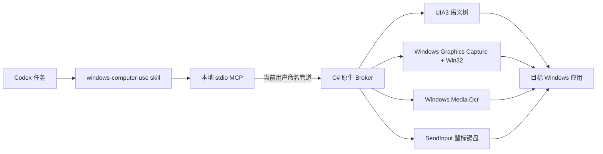

# Windows Computer Use

[English](README.md)

这是一个让 Codex 像人类一样操作 Windows 的本地插件：优先使用 Windows UI Automation 语义控件，在语义层不足时降级到原生鼠标、键盘、截图与 OCR。项目按 Codex 官方插件形态交付，由 **Codex skill + 本地 MCP + C# Windows 原生 Broker** 三层组成。

插件默认运行在 **full-control（完全控制）模式**：自身不维护应用白名单、动作黑名单或二次确认矩阵；当前 Windows 用户能交互的桌面窗口，它都可以寻址和操作。Codex 宿主权限、进程完整性、UAC 安全桌面和 Windows 系统策略仍属于插件外部边界，插件无法绕过。

## 当前已实现

- 基于 FlaUI 的 UI Automation 3 语义检查：名称、AutomationId、控件类型、坐标、焦点、Value/只读/选择/开关/展开/滚动状态、文档文本与选中文本。
- 带 parent/depth/child 元数据的层级 UIA、路径稳定控件 ID、失效元素自动重定位，以及基于 observation ID 的增量差异。
- 语义 `invoke`、显式的 `perform_secondary_action` 聚焦/选择/开关/展开/折叠/滚动动作与 Unicode `enter_text`，失败后降级到原生 SendInput。
- 物理鼠标位置读取、平滑移动/悬停、五键鼠标点击/拖拽/滚轮、可跨动作保持的鼠标按下/释放、带隐式修饰键与重复时序的组合键、可跟踪的键盘按下/释放、应用启动、窗口激活和虚拟桌面坐标。
- 物理多屏拓扑：每块显示器的边界、工作区、有效 DPI、主屏标记和缩放百分比。
- 无系统选框的原生 Windows Graphics Capture 窗口 PNG 捕获，以及完整虚拟桌面屏幕复制；两者都会返回可绑定后续物理输入的新鲜截图 ID。
- 可操作的 `capture_region` 可按截图 ID 裁剪已观测到的精确像素（含嵌套裁剪），也可新捕获窗口/桌面帧；完整来源身份会一直保留，用于物理输入和区域视觉等待。
- 以 DWM 可见边界对齐 WGC，并显式支持 `window` / `screen` / `screenshot` 坐标空间，避免不可见缩放边框造成点击偏移。
- 原生 `Windows.Media.Ocr` 行/词边界；`ocr` 与 `find_text` 既可识别缓存中的完整/区域截图精确像素，也可新捕获画面，并让 OCR 到点击全程保持同一截图身份。
- 本地 PNG/JPEG 模板匹配：可直接搜索缓存中的完整/区域截图精确像素，也可新捕获画面；提供受控 0.25×–4× 多尺度搜索、粗到细采样颜色评分、跨尺度重叠抑制与同帧可操作坐标。
- 原生 Windows OLE 剪贴板文字读写、覆盖全部可物化直接格式的会话内备份令牌，以及原子 `paste_text`/`copy_text`：真实 Ctrl+V/Ctrl+C、语义选择/Value 校验、剪贴板序列跟踪，并在成功或失败后都恢复。
- 窗口 owner/root-owner 关系、用于瞬态弹窗的 `wait_for_window`，以及带验证的最小化/最大化/还原控制。
- 状态条件等待代替盲目 sleep：UIA 使用语义谓词，纯像素变化/稳定使用精确 PNG 等待，`compare_screenshots` 则返回同源两帧的变化像素数、精确总边界和 tile 连通局部区域。
- 一次调用同时返回 UIA 与画面的 `snapshot`，带时间、截图 ID 和 SHA-256；窗口移动、缩放或截图过期后拒绝继续盲点。
- 42 个工具的本地 stdio MCP，以及仅当前用户可连接的命名管道 Broker。
- 与 `desktop-control-for-windows` 共用全局 UI 锁协议。
- 真实 WinForms 端到端测试：MCP 握手、UIA 发现、丰富状态差异、选中文本、二级动作、中文输入、原子粘贴/复制成功与故意失败时的恢复、语义 Invoke、状态等待、窗口/桌面截图、桌面 OCR 到点击、跨动作键鼠手势与清理。

本地视觉语言模型仍未实现；已知的无文字目标可用受控多尺度模板匹配跨越 DPI/缩放差异，陌生视觉和旋转目标仍由 OCR 与模型侧图像推理理解。扩展兼容门禁已覆盖 Word、Excel、VS Code/Electron、微信和 SolidWorks；真正的多屏/混合 DPI 与高完整性边界仍需对应硬件和进程状态。

## 架构



调用方按可靠性选择最高层：应用 API/浏览器 DOM → UIA3 → OCR → 物理像素。Broker 会激活精确目标窗口，通过共享锁串行化实时桌面访问，执行动作，并重新观测结果。详见 [架构说明](plugins/windows-computer-use/docs/architecture.md) 与 [工具参考](plugins/windows-computer-use/skills/windows-computer-use/references/tool-reference.md)。

## 构建与测试

要求：Windows 10/11、PowerShell 5.1+、.NET 8 SDK。仓库脚本也会识别开发机上的 `C:\Users\Clr\.codex\tools\dotnet-sdk-8` SDK。

```powershell
cd "C:\path\to\windows-computer-use\plugins\windows-computer-use"
powershell -NoProfile -ExecutionPolicy Bypass -File .\scripts\test.ps1
```

`test.ps1` 会先校验 Codex 清单、marketplace 路径、MCP 启动器、skill/资源和全部 PowerShell 语法，再还原依赖、构建并发布 Broker/MCP、运行 xUnit、打开隔离的 WinForms 测试窗口，并硬性验证层级 UIA/状态差异、Value 与选中文本、语义二级动作、状态条件等待、键盘保持/隐式修饰键、原始及原子 Ctrl+V/Ctrl+C 往返（含强制粘贴/复制失败后的恢复）、WGC、OCR 与图像模板定位、快照新鲜度和过期坐标拒绝；任一门禁失败都会返回非零退出码。被重定向的 MCP 诊断会异步排空，预期错误再多也不会填满 stderr 管道而让测试死锁。

构建后还可运行 `scripts/real-app-smoke.ps1` 做非破坏性真实应用兼容测试：它会打开隔离的记事本、资源管理器和设置窗口，完成 UIA/截图/OCR，并且只关闭测试前不存在的窗口 ID。

运行 `scripts/extended-app-smoke.ps1` 可覆盖隔离的 Word、Excel 和 VS Code/Electron；追加 `-IncludeWeChat -IncludeSolidWorks` 覆盖已安装的微信与 SolidWorks，`-OptionalOnly` 只跑可选应用。已有同类进程会被跳过保护，测试只读取 UIA/WGC/OCR，并只关闭本次新建的进程组。

## 在 Codex 本地安装测试

先构建，再把仓库根目录加入本地 marketplace：

```powershell
cd "C:\path\to\windows-computer-use\plugins\windows-computer-use"
powershell -NoProfile -ExecutionPolicy Bypass -File .\scripts\build.ps1

cd ..\..
codex plugin marketplace add .
```

随后在 Codex 的本地 **Brave Cow Windows Tools** marketplace 中安装 **Windows Computer Use**。插件 `.mcp.json` 会启动 `scripts/run-mcp.ps1`，再拉起本地 MCP 与原生 Broker。只测试协议时，也可以直接运行该脚本，并从 stdin 输入逐行 MCP JSON-RPC。

## MCP 工具面

42 个工具分别是：`list_windows`、`display_info`、`pointer_position`、`window_from_point`、`launch_app`、`wait_for_window`、`inspect_window`、`observe_changes`、`find_controls`、`invoke`、`perform_secondary_action`、`enter_text`、`paste_text`、`copy_text`、`wait_for_ui`、`wait_for_visual_change`、`wait_for_visual_stable`、`compare_screenshots`、`capture`、`capture_region`、`observe_desktop`、`snapshot`、`ocr`、`find_text`、`find_image`、`read_clipboard_text`、`write_clipboard_text`、`restore_clipboard`、`move_pointer`、`click`、`mouse_down`、`mouse_up`、`press_key`、`key_down`、`key_up`、`type_text`、`scroll`、`drag`、`set_window_state`、`set_window_bounds`、`activate_window`、`end_session`。

窗口应使用 `list_windows` 返回的精确 ID；即使窗口暂时隐藏或无标题，Broker 也会直接按 HWND 恢复描述。如果应用重建 HWND，只有进程 ID、原生窗口类和非空标题仍一致且替代窗口唯一时，旧 ID 才会自动跟随；否则拒绝模糊匹配并要求重新选择。瞬态弹窗用 `wait_for_window` 配合 `owner_window_id` 定位。操作优先使用 `inspect_window`/`find_controls` 返回的稳定控件 ID 和当前状态字段，状态切换后可把旧 `observation_id` 交给 `observe_changes`；需要比主 Invoke 更明确的 UIA 动作时使用 `perform_secondary_action`。确需坐标时，文字用 `find_text`、已知本地图像用可选受控尺度范围的 `find_image`、陌生画面用 `snapshot`，再把返回的 `screenshot_id` 与 `coordinate_space: "screenshot"` 交给坐标动作。`capture`、`ocr`、`find_text`、`find_image` 均支持 `desktop: true`；完整虚拟桌面截图 ID 可直接驱动移动、点击、按下、释放、滚动和拖拽，无需选择或激活窗口，显式 `coordinate_space: "screen"` 也可直接操作整桌面。语义/输入动作会让旧截图失效；目标移动/缩放、显示拓扑变化或超过 `max_age_ms` 后 Broker 会拒绝盲点。窗口级视觉观察前应先还原最小化窗口。旧的选窗调用仍默认使用相对窗口的物理像素。

每次 `move_pointer` 现在都会让旧截图失效并返回新鲜完整来源 `after_screenshot_id`；绑定截图的悬停还会返回顶层 `visual_diff`。绑定截图的 `click`、`mouse_down`、`mouse_up`、`scroll` 和自包含 `drag` 则把等价证据放在 `data.visual_diff`，包含是否可比较、变化数量/比例、最大通道差、精确图像/屏幕总边界和最多 20 个局部区域。把每一步最新 ID 沿 `mouse_down` → `move_pointer` → `mouse_up` 传递，即可在持续跟踪按键状态的同时维持长手势的可信视觉链。来源几何变化时，已执行的输入仍按成功返回，但报告带前后边界的 `comparable=false`。直接屏幕或未绑定截图的移动没有可信前帧，因此 `visual_diff=null`，但仍返回动作后的新桌面/窗口截图 ID。

没有可靠语义谓词时，把新鲜窗口或桌面 `screenshot_id` 交给 `wait_for_visual_change`。它会持续捕获同一来源、校验窗口几何或显示拓扑、比较精确 PNG SHA-256，并在匹配或超时后都返回一张新的可操作截图。能用 `wait_for_ui` 时仍应优先使用它，因为动画、时钟、闪烁光标或桌面任意无关像素变化都可能满足精确画面变化。

变化开始后，可用 `wait_for_visual_stable` 要求新捕获画面连续 `stable_ms` 保持同一精确 PNG 哈希；任一样本变化都会重新计时。超过 `timeout_ms` 仍不稳定时返回 `stable: false` 与最新截图。稳定时长只从调用后真实观测开始计算；时钟、光标、视频和桌面通知可能让整帧永远无法稳定。

需要定位哈希变化时使用 `compare_screenshots`。两个新鲜 ID 必须属于同一窗口/桌面来源、相同几何和完全相同的裁剪区域。Broker 比较解码后的 BGRA 像素，返回精确变化像素数/比例和总边界，再把变化 tile 分组成数量受控、同时带图像与物理屏幕边界的局部区域。`channel_threshold=0` 表示精确比较；只有明确要忽略轻微渲染噪声时才提高。该工具不会重新捕获、激活或发送输入。

只有一个图像区域重要时使用 `capture_region`。传入新鲜 `screenshot_id` 会直接裁剪已经观测到的精确像素，不再二次截图；该 ID 是唯一权威来源，因此不能再混入窗口或桌面选择器。不传 ID 时才新捕获指定窗口或桌面。`x/y/width/height` 相对所选来源图像，也可以相对前一次裁剪；返回 PNG 的 `bounds` 是物理边界，截图坐标 `(0,0)` 直接映射到该物理原点，嵌套裁剪会累加回完整来源偏移。画面变化/稳定等待只重捕最终区域，同时仍校验完整窗口几何或桌面拓扑。

把同一张新鲜完整或区域截图的 `screenshot_id` 交给 `ocr`/`find_text`，即可识别模型已经看到的精确像素。Broker 会校验年龄与原始窗口几何/桌面拓扑，只为 Windows OCR 适配器落一份短生命周期本地 PNG，识别后删除，并原样返回截图 ID、边界和哈希；`find_text` 的中心点因此可直接用同一帧做截图坐标输入。缓存来源不能混入桌面/窗口选择器；`ocr path` 是独立、权威但不可操作的已有图片模式。

`find_image` 也接受同一缓存截图契约，而且无需落盘：本地匹配器在内存中解码缓存 PNG，按精确或受控尺度搜索，并返回绑定原截图 ID/哈希的中心点与物理边界。完成 `snapshot`、`observe_desktop` 或 `capture_region` 后应优先复用该 ID；只有明确需要新帧时才省略它。

仅为传递文本临时借用剪贴板时，优先调用 `paste_text`/`copy_text`：前者替换或追加并等待 UIA Value，后者沿用当前选择或全选、等待真实剪贴板序列变化；未发布或复制结果与可观测 UIA 选区不一致时，最多语义重聚焦重试一次。两者都保存全部直接格式，并在成功或失败后恢复；发布/恢复可容忍最长十秒的外部剪贴板占用竞争。只有任务需要让剪贴板状态跨越多个动作时，才手工组合 `write_clipboard_text` 与 `restore_clipboard`。备份仅存在于当前 Broker 会话；遇到无法安全物化的格式时会在改写前失败。

## 仓库结构

```text
.agents/plugins/marketplace.json       本地 marketplace
plugins/windows-computer-use/
  .codex-plugin/plugin.json            Codex 插件清单
  .mcp.json                            本地 MCP 注册
  skills/windows-computer-use/         Agent 工作流与参考
  src/WindowsComputerUse.Mcp/          MCP stdio 主机
  src/WindowsComputerUse.Broker/       UIA3/Win32/SendInput Broker
  src/WindowsComputerUse.TestApp/      可重复的真实 UI 测试应用
  scripts/                             构建、启动、OCR 与端到端门禁
  tests/                               协议与原生冒烟测试
```

## 许可证

MIT
